# Payment Implementation — Lenco Gateway

> **Codebase:** Roviolt Academy (NestJS + SvelteKit + Drizzle ORM)
> **Gateway:** Lenco (mobile money + card payments)
> **Last updated:** 2026-05-28

---

## Table of Contents

1. [System Architecture Overview](#1-system-architecture-overview)
2. [Environment Variable Reference](#2-environment-variable-reference)
3. [Database Schema](#3-database-schema)
4. [Client-Side Payment Flow](#4-client-side-payment-flow)
5. [Server-Side API Endpoints](#5-server-side-api-endpoints)
6. [Webhook Event Processing](#6-webhook-event-processing)
7. [Webhook Signature Verification](#7-webhook-signature-verification)
8. [Fulfillment Pipeline](#8-fulfillment-pipeline)
9. [Background Jobs & Reconciliation](#9-background-jobs--reconciliation)
10. [Test Coverage Analysis](#10-test-coverage-analysis)
11. [Security Architecture](#11-security-architecture)
12. [Improvement Recommendations](#12-improvement-recommendations)

---

## 1. System Architecture Overview

### 1.1 High-Level Flow

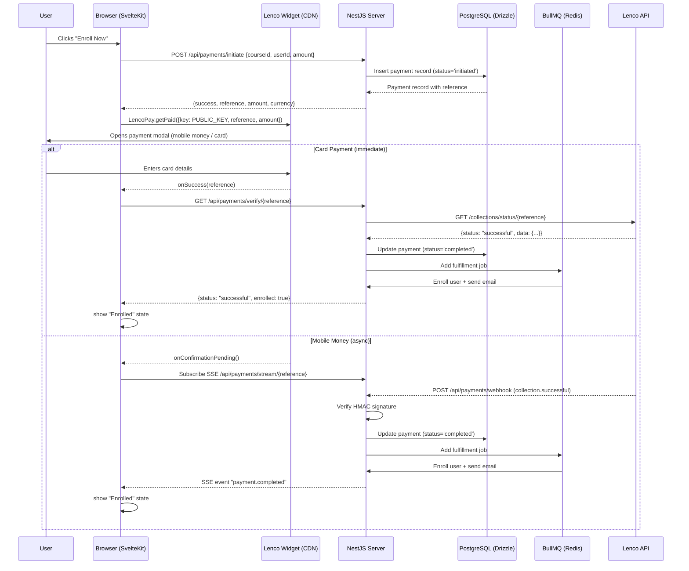

### 1.2 File Map

```
apps/client/src/lib/
├── api/payment.ts                          # Client API wrapper
├── api/schemas/payment.ts                  # Zod schemas for payments
├── api/enrollments.ts                      # Enrollment API
├── types/payment.ts                        # TypeScript interfaces
├── stores/checkout.svelte.ts               # Checkout state store
├── utils/payment-errors.ts                 # Lenco error code mapper
└── components/payment/
    ├── PaymentButton.svelte                # Main payment button (state machine)
    ├── LencoScriptLoader.svelte            # Loads Lenco widget script
    ├── PaymentWidgetPreloader.svelte       # Preloads widget via requestIdleCallback
    ├── PaymentErrorBoundary.svelte         # Error boundary with retry/dismiss
    └── VerifyPaymentButton.svelte          # Manual verification recovery

apps/server/src/modules/payments/
├── payments.module.ts                      # Module wiring + queue registration
├── payments.controller.ts                  # HTTP endpoints (8 routes)
├── payments-admin.controller.ts            # Admin endpoints (5 routes)
├── payments.service.ts                     # Core business logic (1419 lines)
├── payments.cron.ts                        # Hourly reconciliation cron
├── payment-timeout.service.ts              # Stuck payment cleanup (10min + hourly)
├── payment-status.gateway.ts              # SSE real-time status via RxJS Subjects
├── webhook.service.ts                      # HMAC signature verification
├── webhook.service.spec.ts                 # Signature verification tests
├── lenco-api.service.ts                    # Lenco HTTP client
├── currency.service.ts                     # Currency detection + formatting
├── dto/payment.dto.ts                      # Class-validator DTOs
├── types/lenco.types.ts                    # Lenco API TypeScript types
├── utils/error-mapper.ts                   # Error code mapping
├── processors/
│   ├── payment-fulfillment.processor.ts    # Fulfillment worker (BullMQ)
│   └── webhook-retry.processor.ts          # Webhook retry worker (BullMQ)
└── README.md                               # Internal documentation

apps/server/src/drizzle/schema/
└── payments.schema.ts                      # DB schema + Zod validation
    enrollments.schema.ts                   # Enrollment DB schema
```

### 1.3 State Machine

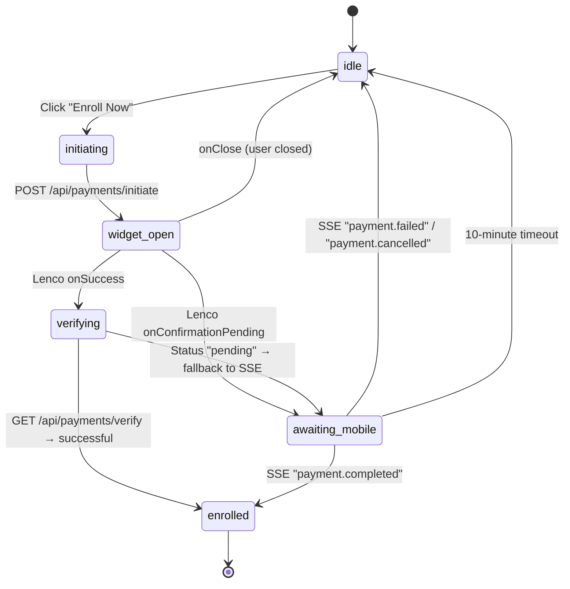

---

## 2. Environment Variable Reference

### 2.1 Complete Variable Table

| Variable | Where Used | Purpose | Required |
|---|---|---|---|
| `LENCO_SECRET_KEY` | `lenco-api.service.ts:54` — axios Bearer auth; `webhook.service.ts:75` — HMAC signing | Production secret key | Yes (prod) |
| `LENCO_PUBLIC_KEY` | `lenco-api.service.ts:54` — stored but not sent to client | Production public key | Yes (prod) |
| `LENCO_BASE_URL` | `lenco-api.service.ts:41` — axios `baseURL` | Production API URL (`https://api.lenco.co/access/v2`) | Default |
| `LENCO_SANDBOX_SECRET_KEY` | `lenco-api.service.ts:49` — axios Bearer auth; `webhook.service.ts:72` — HMAC signing | Sandbox secret key | Yes (dev) |
| `LENCO_SANDBOX_PUBLIC_KEY` | `lenco-api.service.ts:51` — stored only | Sandbox public key | Yes (dev) |
| `LENCO_SANDBOX_URL` | `lenco-api.service.ts:36` — axios `baseURL` | Sandbox API URL (`https://api-sandbox.lenco.co/access/v2`) | Default |
| `LENCO_ENV` | `lenco-api.service.ts:32`, `webhook.service.ts:13`, `payments.service.spec.ts:61` | Force production when `live` | No |
| `PUBLIC_LENCO_PUBLIC_KEY` | `PaymentButton.svelte:118` — `import.meta.env.PUBLIC_LENCO_PUBLIC_KEY` | Client-side key for Lenco widget | Yes |
| `WEBHOOK_URL` | `webhook.service.ts:113` — returned by `getWebhookUrl()` | Configured webhook endpoint URL | No |
| `NODE_ENV` | `lenco-api.service.ts:31`, `webhook.service.ts:12` | `production` = live keys, else sandbox | No |
| `SIGNATURE_KEY` | **Not used in code** — documented in README only | Legacy — actual implementation uses API token | No |

### 2.2 Sandbox vs Production Resolution

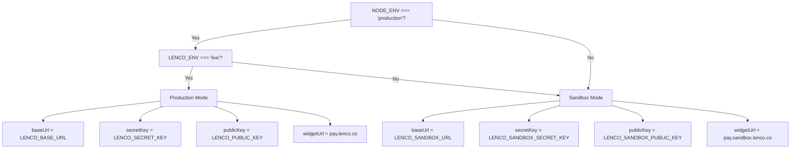

**Critical observation:** The `SIGNATURE_KEY` env var is documented in `payments/README.md` but the actual code in `webhook.service.ts` uses SHA256(API_TOKEN) as the HMAC key, not a raw signature key. This is a doc-vs-implementation gap.

### 2.3 Client-Side Env (`.env.example`)

```env
PUBLIC_LENCO_PUBLIC_KEY=pub-71a12bc1d6083a07e65ccd5d1fbd5252c048893cc80c684e
PUBLIC_API_URL=http://localhost:3000
PUBLIC_APP_NAME="Roviolt Academy"
```

### 2.4 Expected Server-Side Env Configuration

```env
# Lenco API
LENCO_SECRET_KEY=sk_live_your_secret_key_here
LENCO_PUBLIC_KEY=pk_live_your_public_key_here
LENCO_BASE_URL=https://api.lenco.co/access/v2

# Sandbox (development)
LENCO_SANDBOX_SECRET_KEY=sk_sandbox_your_secret_key_here
LENCO_SANDBOX_PUBLIC_KEY=pk_sandbox_your_public_key_here
LENCO_SANDBOX_URL=https://api-sandbox.lenco.co/access/v2

# Override to force production in any NODE_ENV
# LENCO_ENV=live

# Webhook
WEBHOOK_URL=https://your-domain.com/api/payments/webhook
# SIGNATURE_KEY=legacy_field_not_used_in_code

# App
NODE_ENV=development
```

---

## 3. Database Schema

### 3.1 `payments` Table

```sql
-- Enum: payment_status
-- 'initiated' | 'pending' | 'completed' | 'failed' | 'refunded' | 'cancelled' | 'pending_confirmation'

-- Enum: fulfillment_status
-- 'pending' | 'enrolled' | 'failed'

-- Enum: payment_type
-- 'full' | 'installment'
```

| Column | Type | Description |
|---|---|---|
| `id` | `uuid PK` | Primary key |
| `user_id` | `uuid FK → users` | Who paid |
| `course_id` | `uuid FK → courses` | What they bought |
| `amount` | `numeric(10,2)` | Charged amount (includes fee) |
| `currency` | `text` | ISO code (default `ZMW`) |
| `payment_type` | `payment_type` | `full` or `installment` |
| `status` | `payment_status` | Current state |
| `transaction_id` | `text` | Payment processor transaction ID |
| `payment_method` | `text` | `card`, `mobile-money`, `both` |
| `reference` | `text UNIQUE` | Our unique reference (`payment-{ts}-{random}`) |
| `lenco_reference` | `text` | Lenco's reference number |
| `lenco_payment_id` | `text` | Lenco's internal payment ID |
| `payment_channel` | `text` | `card` or `mobile-money` |
| `fee` | `numeric(10,2)` | Processing fee charged |
| `bearer` | `text` | `merchant` or `customer` |
| `source` | `text` | `api` or `banking-app` |
| `settlement_status` | `text` | `settled` or `pending` |
| `settlement_id` | `text` | Lenco's settlement reference |
| `amount_settled` | `numeric(10,2)` | Amount after fees |
| `settlement_type` | `text` | `instant` or `next-day` |
| `settlement_created_at` | `timestamp` | When settlement was created |
| `settlement_settled_at` | `timestamp` | When settlement completed |
| `webhook_processed` | `boolean` | Whether webhook was handled |
| `webhook_attempts` | `integer` | Number of webhook processing attempts |
| `fulfillment_status` | `fulfillment_status` | `pending` → `enrolled` or `failed` |
| `fulfillment_attempts` | `integer` | Number of enrollment retries |
| `fulfillment_error` | `text` | Error message if fulfillment failed |
| `lenco_initiated_at` | `timestamp` | When Lenco widget opened |
| `lenco_completed_at` | `timestamp` | When Lenco completed |
| `metadata` | `jsonb` | Customer, billing, response data |
| `failure_reason` | `text` | Why payment failed |
| `ip_address` | `text` | Client IP |
| `user_agent` | `text` | Client user agent |
| `created_at` | `timestamp` | Default `now()` |
| `updated_at` | `timestamp` | Updated on change |

### 3.2 Supporting Tables

**`webhooks`** — Raw webhook event storage:
```json
{
  "id": "uuid PK",
  "event_type": "text",          // 'collection.successful', etc.
  "lenco_reference": "text",
  "payload": "jsonb",            // Full webhook body
  "processed": "boolean",
  "processing_attempts": "int",
  "last_error": "text",
  "payment_id": "uuid FK→payments",
  "created_at": "timestamp",
  "processed_at": "timestamp"
}
```

**`refunds`** — Refund tracking:
```json
{
  "id": "uuid PK",
  "payment_id": "uuid FK→payments",
  "user_id": "uuid FK→users",
  "amount": "numeric(10,2)",
  "currency": "text",
  "reason": "text",
  "status": "'pending'|'approved'|'rejected'|'processed'",
  "processed_by": "uuid FK→users",
  "processed_at": "timestamp",
  "lenco_refund_id": "text",
  "created_at": "timestamp",
  "updated_at": "timestamp"
}
```

**`payment_audit_logs`** — Full lifecycle audit trail:
```json
{
  "id": "uuid PK",
  "payment_id": "uuid FK→payments",
  "event": "text",               // 'INITIATED', 'VERIFIED', 'FULFILLMENT_STARTED', etc.
  "details": "jsonb",            // Event-specific metadata
  "created_at": "timestamp"
}
```

**`course_enrollments`** — Enrollment after successful payment:
```json
{
  "id": "uuid PK",
  "course_id": "uuid FK→courses",
  "user_id": "uuid FK→users",
  "payment_id": "uuid FK→payments",
  "price_paid": "numeric(10,2)",
  "currency_paid": "text",
  "enrolled_at": "timestamp",
  "expires_at": "timestamp",
  "completed_at": "timestamp",
  "created_at": "timestamp",
  "updated_at": "timestamp"
}
```

### 3.3 Status State Machine

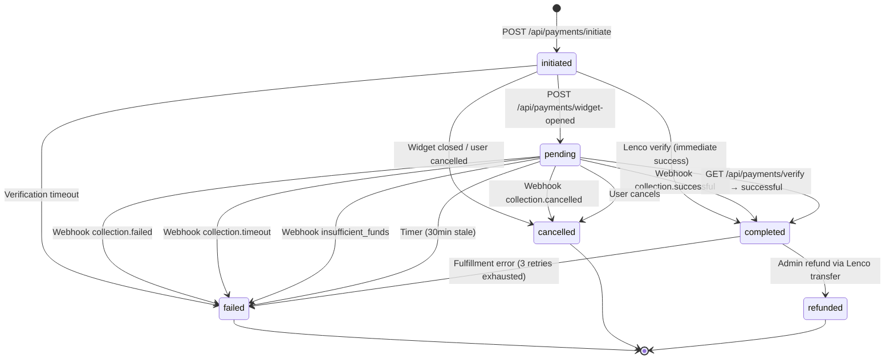

---

## 4. Client-Side Payment Flow

### 4.1 Widget Script Loading

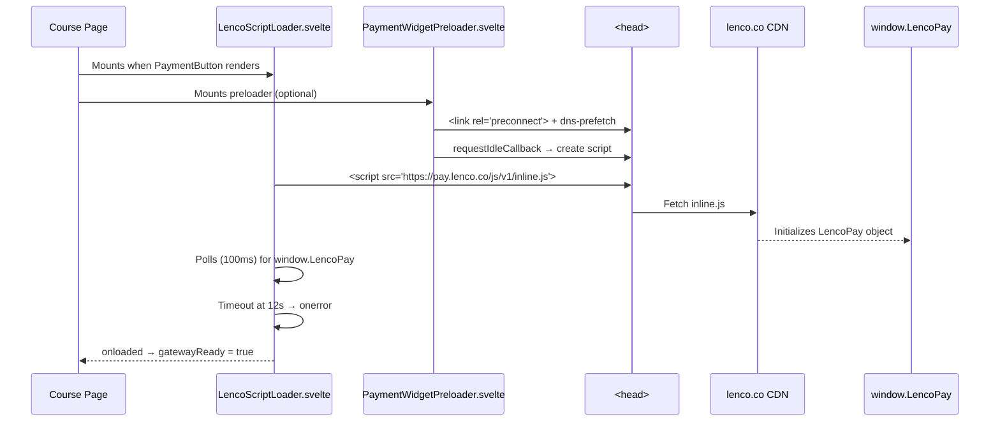

**Implementation detail:** Both `LencoScriptLoader.svelte` and `PaymentWidgetPreloader.svelte` hardcode the production widget URL:

```typescript
// LencoScriptLoader.svelte:12
const WIDGET_URL = 'https://pay.lenco.co/js/v1/inline.js';

// PaymentWidgetPreloader.svelte:9-13
const PRODUCTION_URL = 'https://pay.lenco.co/js/v1/inline.js';
const SANDBOX_URL = 'https://pay.sandbox.lenco.co/js/v1/inline.js';
const DEFAULT_URL = PRODUCTION_URL;  // Always production
```

**Why always production?** The comment in both files explains: *"sandbox widget is often flaky on localhost and often redirects improperly when using actual production keys."* This means the widget URL does **not** follow `LENCO_ENV` — it always points to production.

### 4.2 PaymentButton State Machine

```typescript
type PayState =
  | 'idle'               // Initial, gateway loaded
  | 'initiating'         // POST /api/payments/initiate in flight
  | 'widget_open'        // Lenco widget visible to user
  | 'verifying'          // onSuccess fired, verifying with server
  | 'awaiting_mobile'    // Mobile money awaiting PIN approval
  | 'enrolled';          // Payment confirmed, enrolled
```

### 4.3 Full Button Click Execution

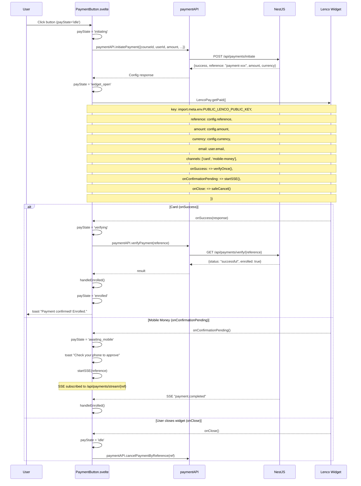

### 4.4 SSE Subscription

```typescript
// PaymentButton.svelte:198-246
function startSSE(ref: string) {
  sseSource = new EventSource(`/api/payments/stream/${ref}`, {
    withCredentials: true
  });

  sseSource.addEventListener('payment.completed', () => {
    handleEnrolled();
    closeSSE();
  });

  sseSource.addEventListener('payment.failed', (e) => {
    payState = 'idle';
    toast.error(data.reason || 'Payment failed');
    closeSSE();
  });

  sseSource.addEventListener('payment.cancelled', () => {
    payState = 'idle';
    toast.info('Payment was cancelled.');
    closeSSE();
  });

  // 10-minute mobile money timeout
  mobileMoneyTimeout = setTimeout(() => {
    closeSSE();
    if (payState === 'awaiting_mobile') {
      payState = 'idle';
      toast.info('Payment is taking longer than expected. Check your dashboard.');
    }
  }, 10 * 60 * 1000);
}
```

### 4.5 Client API Layer

```typescript
// apps/client/src/lib/api/payment.ts
class PaymentAPI {
  private baseUrl = '/payments';

  async initiatePayment(data: InitiatePaymentDto): Promise<PaymentInitiationResponse>
  // POST /payments/initiate → {success, reference, amount, currency}

  async verifyPayment(reference: string): Promise<PaymentVerificationResponse>
  // GET /payments/verify/{reference} → {success, status, amount, enrolled}

  async getUserPayments(userId: string): Promise<PaymentTransaction[]>
  // GET /payments/user/{userId}

  async cancelPayment(paymentId: string): Promise<void>
  // POST /payments/cancel/{id}

  async cancelPaymentByReference(reference: string): Promise<void>
  // POST /payments/cancel-by-reference/{reference}

  async abandonPayment(reference: string, reason: string): Promise<void>
  // POST /payments/abandon

  async markWidgetOpened(reference: string): Promise<void>
  // POST /payments/widget-opened
}
```

### 4.6 Expected Initiate Payment Request

```json
{
  "courseId": "550e8400-e29b-41d4-a716-446655440000",
  "userId": "660e8400-e29b-41d4-a716-446655440001",
  "amount": 110.00,
  "currency": "ZMW",
  "email": "student@example.com",
  "customer": {
    "firstName": "John",
    "lastName": "Doe",
    "phone": "+260977123456"
  },
  "billing": {
    "country": "ZM"
  },
  "paymentMethod": "both"
}
```

### 4.7 Expected Initiate Payment Response

```json
{
  "success": true,
  "reference": "payment-1705123456789-abc123",
  "amount": 110.00,
  "currency": "ZMW"
}
```

### 4.8 Expected Verify Payment Response

```json
{
  "success": true,
  "status": "successful",
  "amount": 110.00,
  "currency": "ZMW",
  "paymentMethod": "mobile-money",
  "transactionId": "d7bd9ccb-0737-4e72-a387-d00454341f21",
  "lencoReference": "240720004",
  "fee": 2.50,
  "processedAt": "2024-03-12T07:14:10.412Z",
  "enrolled": true
}
```

---

## 5. Server-Side API Endpoints

### 5.1 Endpoint Table

| Method | Path | Auth | Purpose |
|---|---|---|---|
| `POST` | `/api/payments/initiate` | JWT (5/min throttle) | Create payment record |
| `POST` | `/api/payments/cancel/:id` | JWT | Cancel by payment ID |
| `POST` | `/api/payments/cancel-by-reference/:reference` | JWT | Cancel by reference |
| `GET` | `/api/payments/verify/:reference` | Public | Verify with Lenco API |
| `POST` | `/api/payments/webhook` | Public (signature) | Lenco webhook receiver |
| `POST` | `/api/payments/abandon` | JWT | Mark abandoned |
| `POST` | `/api/payments/widget-opened` | JWT | Initiated → pending |
| `GET` | `/api/payments/user/:userId` | JWT | User's payment history |
| `GET` | `/api/payments/stream/:reference` | JWT (SSE) | Real-time status stream |
| `GET` | `/api/payments/webhook/health` | Public | Health check |
| `GET` | `/api/admin/payments/failed` | JWT+Admin | Failed payments list |
| `GET` | `/api/admin/payments/failed-fulfillment` | JWT+Admin | Failed fulfillments list |
| `POST` | `/api/admin/payments/retry-fulfillment/:paymentId` | JWT+Admin | Retry fulfillment |
| `GET` | `/api/admin/payments/audit/:paymentId` | JWT+Admin | Audit trail |
| `GET` | `/api/admin/payments/stats` | JWT+Admin | Payment statistics |
| `GET` | `/api/admin/payments/refunds` | JWT+Admin | Refunds list |

### 5.2 `POST /api/payments/initiate` — Server Logic

```mermaid
flowchart TD
    A[Receive InitiatePaymentDto] --> B[Fetch course from DB]
    B --> C{Course exists?}
    C -->|No| D[Throw NotFoundException]
    C -->|Yes| E[Check isEnrolled via EnrollmentsService]
    E -->|Already enrolled| F[Throw 'Already enrolled']
    E -->|Not enrolled| G[Check refund cool-off: 30 days]
    G -->|Recent refund| H[Throw 'Wait 30 days']
    G -->|No recent refund| I[Calculate regional pricing]
    I --> J[Apply 10% transfer fee]
    J --> K[Generate or use provided reference]
    K --> L[Insert payment: status='initiated']
    L --> M[Audit log: 'INITIATED']
    M --> N[Return {success, reference, amount, currency}]
```

**Key code path:** `payments.service.ts:58-180`

```typescript
// Server recalculates amount — ignores client-provided value for security
let finalAmount = Number(course.basePrice);          // From DB
const regionalPricing = course.regionalPricing;       // Per-country pricing
const TRANSFER_FEE_PERCENTAGE = 0.1;                 // 10% fee
const amount = Number((finalAmount * 1.1).toFixed(2)); // Server-calculated total

// Idempotent insert
const insertResult = await this.drizzle
  .insert(payments)
  .values({ ... })
  .onConflictDoNothing({ target: payments.reference })
  .returning();
```

### 5.3 `GET /api/payments/verify/:reference` — Server Logic

```mermaid
flowchart TD
    A[Receive reference] --> B[Query local DB for payment]
    B --> C{Payment found?}
    C -->|No| D[Throw 'Payment not found']
    C -->|Yes| E{Status is terminal?<br/>completed/failed/refunded}
    E -->|Yes| F[Return current state + enrollment status]
    E -->|No| G[Call Lenco API: GET /collections/status/{ref}]
    G --> H{Lenco response?}
    H -->|Error| I[Throw error]
    H -->|Success| J{Map Lenco status}
    J -->|'successful'| K[Update DB: status='completed']
    J -->|'pending'/'pay-offline'/'pending_confirmation'| L[Update DB: status='pending']
    J -->|Other| M[Update DB: status='failed']
    K --> N[Queue fulfillment job via BullMQ]
    N --> O[Return {status, amount, enrolled}]
    L --> O
    M --> O
```

**Key code path:** `payments.service.ts:194-446`

### 5.4 `POST /api/payments/webhook` — Receiver

```typescript
// payments.controller.ts:166-196
async processWebhook(
  @Body() webhookDto: WebhookDto,
  @Headers() headers: Record<string, string | string[] | undefined>,
) {
  const signature = this.paymentsService.extractWebhookSignature(headers);
  if (!signature) throw new UnauthorizedException('Missing signature');

  const result = await this.paymentsService.processWebhook(webhookDto, signature);
  if (!result.success) {
    if (result.message === 'Invalid signature')
      throw new UnauthorizedException('Invalid webhook signature');
    throw new BadRequestException(result.message);
  }
  return result;
}
```

### 5.5 Expected Webhook Payload

```json
{
  "event": "collection.successful",
  "data": {
    "id": "d7bd9ccb-0737-4e72-a387-d00454341f21",
    "reference": "payment-1705123456789-abc123",
    "lencoReference": "240720004",
    "status": "successful",
    "amount": "110.00",
    "fee": "2.50",
    "bearer": "merchant",
    "currency": "ZMW",
    "type": "mobile-money",
    "source": "api",
    "initiatedAt": "2024-03-12T07:00:00Z",
    "completedAt": "2024-03-12T07:05:00Z",
    "settlementStatus": "settled",
    "settlement": {
      "id": "stl-001",
      "amountSettled": "107.50",
      "currency": "ZMW",
      "createdAt": "2024-03-12T07:05:00Z",
      "settledAt": "2024-03-12T07:05:30Z",
      "status": "settled",
      "type": "instant",
      "accountId": "acc-001"
    },
    "mobileMoneyDetails": {
      "country": "ZM",
      "phone": "+260977123456",
      "operator": "airtel",
      "accountName": "John Doe",
      "operatorTransactionId": "TXN123456"
    }
  }
}
```

### 5.6 SSE Endpoint

```typescript
// payment-status.gateway.ts
@Injectable()
export class PaymentStatusGateway {
  private readonly subjects = new Map<string, Subject<PaymentStatusPayload>>();

  getSubject(reference: string): Subject<PaymentStatusPayload> {
    if (!this.subjects.has(reference)) {
      this.subjects.set(reference, new Subject<PaymentStatusPayload>());
    }
    return this.subjects.get(reference)!;
  }

  emit(reference: string, payload: PaymentStatusPayload) {
    const subject = this.subjects.get(reference);
    if (subject && !subject.closed) {
      subject.next(payload);
      if (['payment.completed', 'payment.failed', 'payment.cancelled'].includes(payload.event)) {
        subject.complete();
        this.subjects.delete(reference);
      }
    }
  }
}
```

**SSE message types:**

```
event: payment.completed
data: {"event":"payment.completed","reference":"payment-xxx"}

event: payment.failed
data: {"event":"payment.failed","reference":"payment-xxx","reason":"Insufficient funds"}

event: payment.cancelled
data: {"event":"payment.cancelled","reference":"payment-xxx"}
```

---

## 6. Webhook Event Processing

### 6.1 Event Handler Map

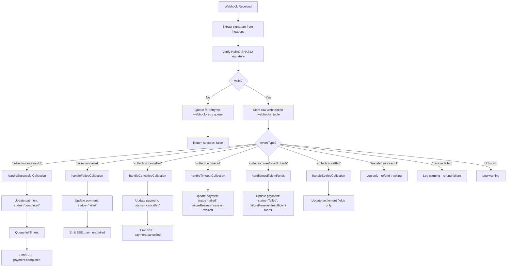

### 6.2 Event Type Details

| Event | Status Transition | Actions |
|---|---|---|
| `collection.successful` | `initiated/pending → completed` | Queue fulfillment, emit SSE |
| `collection.failed` | `initiated/pending → failed` | Store failure reason, emit SSE |
| `collection.cancelled` | `initiated/pending → cancelled` | Emit SSE |
| `collection.timeout` | `initiated/pending → failed` | Reason: "Payment session expired" |
| `collection.insufficient_funds` | `initiated/pending → failed` | Reason: "Insufficient funds" |
| `collection.settled` | No status change | Update settlement fields only |
| `transfer.successful` | No change | Log (refund completed) |
| `transfer.failed` | No change | Log warning (refund failed) |

### 6.3 Expected Webhook Flow for Mobile Money

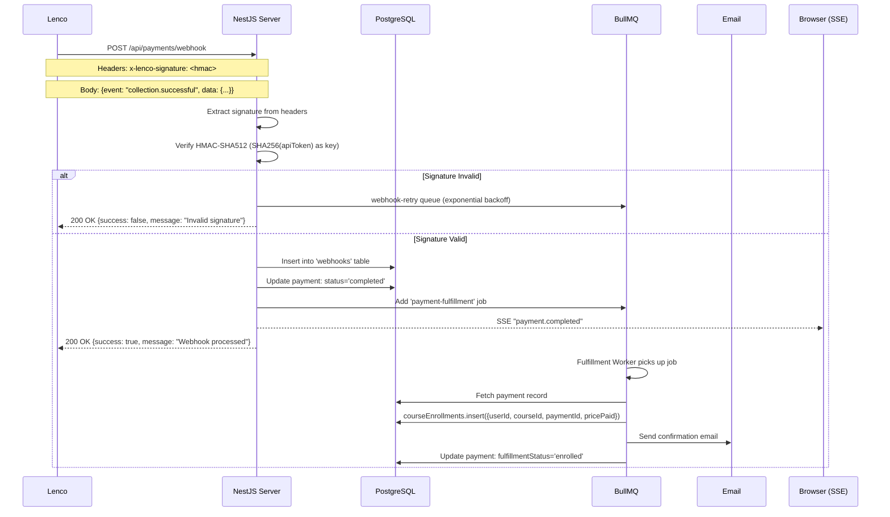

---

## 7. Webhook Signature Verification

### 7.1 Algorithm

```mermaid
flowchart TD
    A[Incoming webhook] --> B[Read x-lenco-signature header]
    B --> C[Get API token from env]
    C --> D{isSandbox?}
    D -->|Yes| E[Use LENCO_SANDBOX_SECRET_KEY]
    D -->|No| F[Use LENCO_SECRET_KEY]
    E --> G[SHA256 hash of API token → webhookHashKey]
    F --> G
    G --> H[HMAC-SHA512(payload, webhookHashKey) → expectedSignature]
    H --> I[crypto.timingSafeEqual(expectedSignature, receivedSignature)]
    I --> J{Match?}
    J -->|Yes| K[Accept webhook]
    J -->|No| L[Reject + queue for retry]
```

### 7.2 Implementation

```typescript
// webhook.service.ts:19-66
verifySignature(payload: string, signature: string): boolean {
  const apiToken = this.getApiToken();       // LENCO_SECRET_KEY or LENCO_SANDBOX_SECRET_KEY
  
  // 1. SHA256 hash of API token
  const webhookHashKey = crypto
    .createHash('sha256')
    .update(apiToken)
    .digest('hex');
  
  // 2. HMAC-SHA512 of payload using webhookHashKey
  const expectedSignature = crypto
    .createHmac('sha512', webhookHashKey)
    .update(payload)
    .digest('hex');
  
  // 3. Timing-safe comparison
  return crypto.timingSafeEqual(
    Buffer.from(signature),
    Buffer.from(expectedSignature)
  );
}
```

### 7.3 Header Resolution Order

```typescript
extractSignature(headers): string {
  return headers['x-lenco-signature']
      || headers['x-lenco-webhook-signature']
      || headers['lenco-signature']
      || headers['webhook-signature']
      || '';
}
```

### 7.4 Expected Signature Generation (for testing)

```typescript
// scripts/test_lenco_integration.ts
const apiToken = process.env.LENCO_SECRET_KEY;
const webhookHashKey = crypto.createHash('sha256').update(apiToken).digest('hex');
const signature = crypto
  .createHmac('sha512', webhookHashKey)
  .update(JSON.stringify(payload))
  .digest('hex');

// Set header: x-lenco-signature: <signature>
```

---

## 8. Fulfillment Pipeline

### 8.1 Queue Architecture

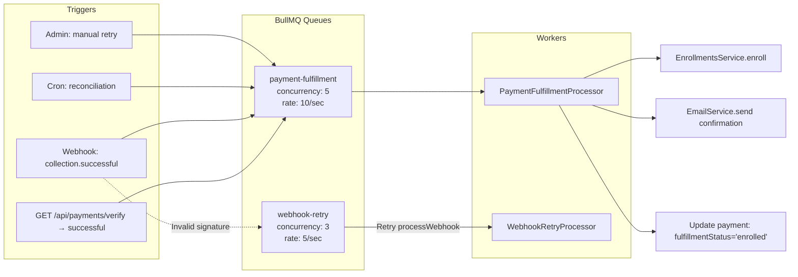

### 8.2 Fulfillment Flow

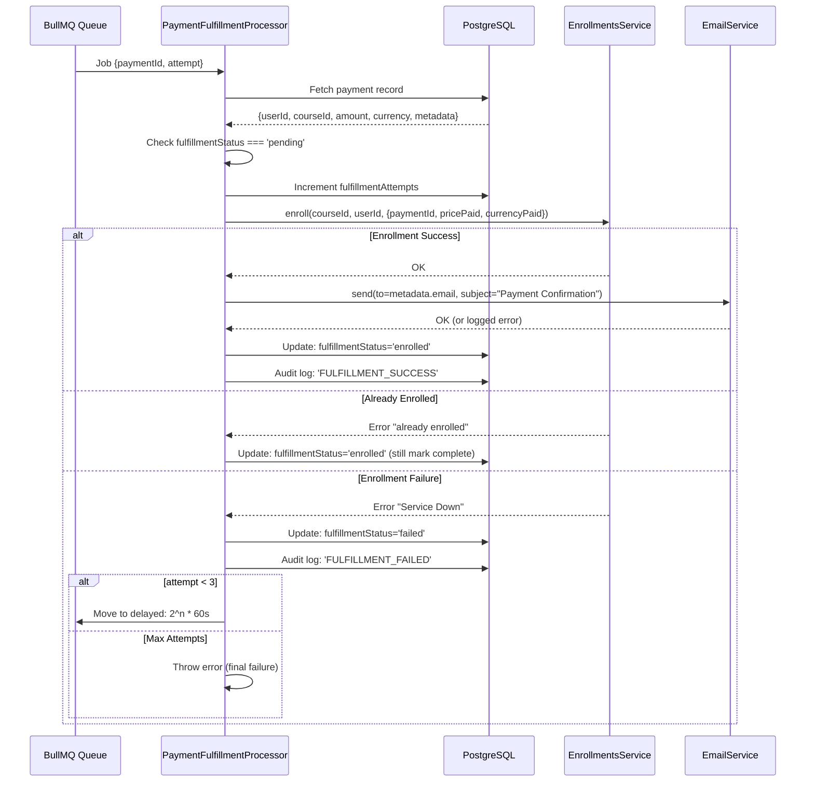

### 8.3 Expected Fulfillment Job Data

```json
{
  "paymentId": "550e8400-e29b-41d4-a716-446655440000",
  "attempt": 1
}
```

### 8.4 Email Template

```html
<h1>Payment Successful!</h1>
<p>Thank you for your payment of <strong>ZMW 110.00</strong>.</p>
<p>You have been successfully enrolled in the course.</p>
<p>Reference: payment-1705123456789-abc123</p>
```

### 8.5 Webhook Retry

```typescript
// processors/webhook-retry.processor.ts
// Retries processWebhook with exponential backoff: 2^(n-1) * 60s
// attempt 1: immediate → 1min → 2min → max 3 attempts
```

---

## 9. Background Jobs & Reconciliation

### 9.1 Job Schedule

| Cron | Service | Purpose | Configurable |
|---|---|---|---|
| `EVERY_HOUR` | `PaymentsCron.handleCron()` | Reconcile pending (30min+) and completed-but-not-fulfilled (5min+) | No |
| `EVERY_10_MINUTES` | `PaymentTimeoutService.cleanupStuckPendingPayments()` | Mark stale `pending` as `failed` | `PAYMENT_PENDING_TIMEOUT_MINUTES` (default 30) |
| `EVERY_HOUR` | `PaymentTimeoutService.cleanupOldPendingConfirmations()` | Mark stale `pending_confirmation` as `failed` | `PAYMENT_CONFIRMATION_TIMEOUT_MINUTES` (default 120) |

### 9.2 Distributed Locking

Both timeout services use Redis distributed locks to prevent concurrent execution across multiple instances:

```typescript
const lockKey = 'lock:payment-timeout:pending';
const lock = await this.redis.set(lockKey, '1', 'EX', 55, 'NX');
if (!lock) {
  this.logger.debug('Skipping cleanup — another instance holds the lock');
  return;
}
try { /* ... */ } finally { await this.redis.del(lockKey); }
```

### 9.3 Reconciliation Flow

```mermaid
flowchart TD
    A[Hourly Cron Triggered] --> B[Fetch pending payments >30min old]
    B --> C[For each: call verifyPayment(reference)]
    C --> D[Fetch completed-but-not-fulfilled payments >5min old]
    D --> E[For each: call reconcileFulfillment]
    E --> F[processSuccessfulPayment → enrollment + email]
```

### 9.4 Expected Cron Log Output

```
[PaymentsCron] Starting payment reconciliation job...
[PaymentsCron] Found 3 pending payments to reconcile.
[PaymentsCron] Reconciling payment: payment-1705123456789-abc123
[PaymentsCron] Found 1 completed-but-not-fulfilled payments to reconcile.
[PaymentsCron] Successfully reconciled fulfillment for: payment-1705123456790-def456
[PaymentsCron] Payment reconciliation job completed.
```

---

## 10. Test Coverage Analysis

### 10.1 Test Suite Overview

| Test File | Lines | Tests | Type | Coverage Area |
|---|---|---|---|---|
| `payments.service.spec.ts` | 1268 | ~40 | Unit | Core business logic |
| `webhook.service.spec.ts` | 149 | ~10 | Unit | Signature verification |
| `payments.e2e-spec.ts` | 328 | 6 | E2E | Full lifecycle |

### 10.2 `payments.service.spec.ts` — Test Breakdown

#### `initiatePayment` (8 tests)

| Test | What It Verifies |
|---|---|
| Basic initiation | Creates pending record, returns config |
| Reference generation | Auto-generates `payment-{ts}-{random}` format |
| Custom reference | Uses provided reference if given |
| Idempotency | `onConflictDoNothing` handles duplicate refs |
| Metadata storage | Customer/billing data saved in payment.metadata |
| Regional pricing | NG price 50000 → 55000 with 10% fee |
| Cool-off period | Rejects if refund within 30 days |
| DB failure | Propagates DB errors |

#### `verifyPayment` (10 tests)

| Test | What It Verifies |
|---|---|
| Successful payment | Updates DB, queues fulfillment, returns status |
| Fulfillment after verify | `fulfillmentQueue.add` called with correct args |
| Failed payment | No enrollment, no email |
| Double-processing | Idempotent: second call returns existing state |
| Lenco API error | Propagates timeout error |
| Invalid reference | Throws "Resource not found" |
| Race condition | Two concurrent verifications → one fulfillment |
| Pending status | Returns `pending`, no enrollment |
| Missing payment | Throws "Payment not found" |
| Stores Lenco response | Metadata updated with Lenco data |

#### `refundPayment` (7 tests)

| Test | What It Verifies |
|---|---|
| Successful refund | Lenco transfer + DB update + audit log |
| Payment not found | Throws "Payment not found" |
| Wrong status | Only completed payments refundable |
| 14-day limit | Expired refunds rejected |
| Missing phone | Throws "phone not found" |
| Transfer failure | Lenco error propagated |
| Default operator | Falls back to 'airtel' |

#### `processWebhook` (10 tests)

| Test | What It Verifies |
|---|---|
| Invalid signature | Returns `{success: false}` |
| collection.successful | Updates DB, queues fulfillment |
| collection.failed | No enrollment, status='failed' |
| Double-processing | Idempotent webhook handling |
| Logging on failure | Webhook event stored even on error |
| Non-existent payment | Logs but doesn't crash |
| Concurrent delivery | Race condition → one fulfillment |
| Unknown event type | Returns success without error |
| collection.settled | Settlement fields updated |
| collection.timeout | Status='failed', failureReason set |
| insufficient_funds | Specific failure reason stored |
| transfer.successful | Logged, no enrollment attempted |
| transfer.failed | Logged as warning |

#### `processSuccessfulPayment` (3 tests)

| Test | What It Verifies |
|---|---|
| Full success | Enrolls user, sends email, marks enrolled |
| Already enrolled | Graceful handling, still marks enrolled |
| Enrollment failure | Sets fulfillmentStatus='failed', audit logged |

#### `healthCheck` (1 test)

| Test | What It Verifies |
|---|---|
| All services up | Returns 'healthy' with lenco + database true |

### 10.3 `webhook.service.spec.ts` — Test Breakdown

| Test | What It Verifies |
|---|---|
| Production signature | Valid HMAC-SHA512 with LENCO_SECRET_KEY |
| Sandbox signature | Valid HMAC-SHA512 with LENCO_SANDBOX_SECRET_KEY |
| Key fallback | Sandbox falls back to LENCO_SECRET_KEY if sandbox key missing |
| Invalid signature | Returns false |
| Empty signature | Returns false |
| x-lenco-signature header | Extracts correctly |
| Array header | Handles multiple header values |
| Missing header | Returns empty string |
| Configured webhook URL | Returns env value |
| Missing WEBHOOK_URL | Returns fallback URL |

### 10.4 `payments.e2e-spec.ts` — Test Breakdown

| Test | What It Verifies |
|---|---|
| Initiate payment | Full HTTP round-trip, creates DB record |
| Verify payment | Lenco API mock → successful status |
| Cool-off period | Refund + re-initiate rejected with 400 |
| Valid webhook | Proper signature → 200 success |
| Invalid webhook | Wrong signature → success: false |
| Admin stats | Authenticated admin can access stats |
| Admin auth | Regular user gets 403 on admin endpoints |

### 10.5 Coverage Gaps

| Area | Missing Tests | Risk |
|---|---|---|
| `PaymentButton.svelte` | No component tests | UI state machine unverified |
| `lenco-api.service.ts` | No unit tests | API client untested |
| `payments.cron.ts` | No tests | Reconciliation logic unverified |
| `payment-timeout.service.ts` | No tests | Cleanup logic unverified |
| `processors/*` | No separate tests | Processors tested only via service |
| `payments-admin.controller.ts` | No direct tests | Admin endpoints tested via E2E only |
| SSE gateway | No tests | Real-time events unverified |
| `currency.service.ts` | No tests | Currency logic unverified |
| Concurrent webhook + verify | No tests | Race between polling and webhook |
| Payment timeout expiry | No tests | Timer-based edge cases |
| Installment payments | No tests | `paymentPlans` schema unused in code |

---

## 11. Security Architecture

### 11.1 Threat Mitigation Table

| Threat | Mitigation | Implementation |
|---|---|---|
| User ID tampering | Force userId from JWT | `dto.userId = req.user.id` in controller:83 |
| Amount manipulation | Server recalculates from DB price | `payments.service.ts:107-131` ignores client amount |
| Payment reference collision | `onConflictDoNothing` | `payments.service.ts:160` |
| Refund-rebuy loop | 30-day cool-off period | `payments.service.ts:86-104` |
| Webhook forgery | HMAC-SHA512 + timing-safe comparison | `webhook.service.ts:19-66` |
| Rate limiting | 5 req/min on initiate | `@Throttle()` decorator:75 |
| Enrollment race | Atomic WHERE clause (`status IN ('initiated','pending')`) | Update query guards:619 |
| Fulfillment double-processing | `fulfillmentStatus` check | `payments.service.ts:808` |
| Stale payment expiry | Cron cleanup (30min / 120min) | `payment-timeout.service.ts` |
| SSE hijacking | JWT auth required | `@UseGuards(JwtAuthGuard)` on stream:54 |
| Refund eligibility | 14-day window | `payments.service.ts:1218-1221` |
| CSRF | SameSite cookie + XSRF-TOKEN | `configuration.ts:50-60` |
| Admin access | RolesGuard + @Roles('admin') | `payments-admin.controller.ts:18-19` |

### 11.2 Key Security Code Patterns

**Amount integrity** — server recalculates, ignores client:
```typescript
// payments.service.ts:107-131
let finalAmount = Number(course.basePrice);  // Source of truth: DB
if (regionalPricing && billing?.country) {
  finalAmount = regionalPricing[billing.country].price;  // Per-country override
}
const amount = Number((finalAmount * 1.1).toFixed(2));  // 10% fee
```

**Atomic update guard** — prevents concurrent processing:
```typescript
// payments.service.ts:347-352
.where(
  and(
    eq(payments.reference, reference),
    sql`${payments.status} IN ('initiated', 'pending')`,
  ),
)
```

**Idempotent insert** — prevents duplicate references:
```typescript
// payments.service.ts:160
.onConflictDoNothing({ target: payments.reference })
```

---

## 12. Improvement Recommendations

### 12.1 Priority Matrix

| Priority | Issue | Impact | Effort | File |
|---|---|---|---|---|
| 🔴 High | `SIGNATURE_KEY` dead env var | Low (code self-sufficient) | ✅ Quick fix | Docs + remove from `.env.example` |
| 🔴 High | Missing DB transaction for payment+enrollment | Race condition on crash between DB write and queue | Medium | `payments.service.ts:823` |
| 🔴 High | 10% fee hardcoded in 3 places | Inconsistent if changed | ✅ Quick fix | `PaymentButton.svelte:48`, `payments.service.ts:127` |
| 🔴 High | SSE subject leak on client disconnect | Memory leak in production | Medium | `payment-status.gateway.ts:30` |
| 🟡 Medium | Widget URL doesn't follow LENCO_ENV | Can't test sandbox widget | ✅ Quick fix | `LencoScriptLoader.svelte:12` |
| 🟡 Medium | No retry queue for failed fulfillment | Fulfillment failures require manual admin retry | High | `payment-fulfillment.processor.ts` |
| 🟡 Medium | Regional pricing needs IP geolocation | Users can lie about billing.country | Medium | `payments.service.ts:115` |
| 🟡 Medium | Missing user ownership check in `user/:userId` | Comment says "Add check in production" | Medium | `payments.controller.ts:246` |
| 🟢 Low | Refund `getAccounts()` could fail | No fallback if first account empty | Low | `lenco-api.service.ts:244` |
| 🟢 Low | Tests missing for 8 service files | Coverage gaps in critical path | High | See §10.5 |

### 12.2 Critical Fixes

**1. `SIGNATURE_KEY` cleanup** — The README documents a `SIGNATURE_KEY` env var, but the actual webhook service uses `LENCO_SECRET_KEY` / `LENCO_SANDBOX_SECRET_KEY` hashed with SHA256 as the HMAC key. Either update the README to remove reference to `SIGNATURE_KEY`, or if Lenco's docs actually specify a separate signature key, the implementation needs updating.

**2. Add DB transactions around payment fulfillment:**

```typescript
// Current — no transaction:
await this.enrollmentsService.enroll(...);
await this.emailService.send(...);
await this.drizzle.update(payments)...fulfillmentStatus='enrolled';

// Expected — with transaction:
await this.drizzle.transaction(async (tx) => {
  await tx.insert(courseEnrollments).values({...});
  await tx.update(payments).set({fulfillmentStatus: 'enrolled'}).where(eq(payments.id, paymentId));
  // If email fails, enrollment is still committed
});
```

**3. Make fee configurable via env:**

```typescript
// current:
const TRANSFER_FEE_PERCENTAGE = 0.1;

// expected:
const TRANSFER_FEE_PERCENTAGE = this.configService.get<number>('PAYMENT_FEE_PERCENTAGE', 0.1);
```

### 12.3 Medium Improvements

**4. Follow `LENCO_ENV` for widget URL:**
The `LencoScriptLoader` and `PaymentWidgetPreloader` should expose a prop or read from the server to decide between sandbox and production widget URLs, matching the server's `lenco-api.service.ts` logic.

**5. Add fulfillment retry queue:**
Create a dedicated retry mechanism for fulfillment failures (separate from webhook retry). Currently, if fulfillment exhausts 3 attempts, the payment is stuck in `fulfillmentStatus='failed'` and requires admin manual retry via `POST /admin/payments/retry-fulfillment/:paymentId`.

**6. SSE cleanup on disconnect:**
```typescript
// Current — subjects persist until terminal event:
this.subjects.set(reference, new Subject());

// Expected — add cleanup on client disconnect:
// In the controller, add a finalize operator to clean up:
return this.paymentsService.statusGateway.getSubject(reference).pipe(
  map(payload => ({ type: payload.event, data: payload })),
  finalize(() => this.paymentsService.statusGateway.cleanup(reference)),
);
```

### 12.4 Low Improvements

**7. IP geolocation for regional pricing:**
Instead of trusting `billing.country` from the client, use a geo-IP lookup (e.g., `maxmind` or Cloudflare `CF-IPCountry` header) to determine the user's country and apply regional pricing server-side.

**8. Refund account fallback:**
The `createMobileMoneyTransfer` method fetches the first available account. Add fallback logic to try multiple accounts or cache the account ID.

---

## Appendix A: Key File Reference

| File | Lines | Purpose |
|---|---|---|
| `apps/client/src/lib/components/payment/PaymentButton.svelte` | 298 | Main UI component with state machine + SSE |
| `apps/client/src/lib/api/payment.ts` | 103 | Client-side API wrapper |
| `apps/client/src/lib/api/schemas/payment.ts` | 154 | Zod schemas for payment DTOs |
| `apps/client/src/lib/types/payment.ts` | 87 | TypeScript interfaces + Window.LencoPay declaration |
| `apps/client/src/lib/stores/checkout.svelte.ts` | 58 | Global checkout state store |
| `apps/client/src/lib/utils/payment-errors.ts` | 32 | Lenco error code → user message |
| `apps/client/src/lib/components/payment/LencoScriptLoader.svelte` | 87 | Loads Lenco widget script dynamically |
| `apps/client/src/lib/components/payment/PaymentWidgetPreloader.svelte` | 76 | Preloads widget via requestIdleCallback |
| `apps/client/src/lib/components/payment/PaymentErrorBoundary.svelte` | 152 | Error boundary with retry/dismiss |
| `apps/client/src/lib/components/payment/VerifyPaymentButton.svelte` | 62 | Manual payment verification |
| `apps/server/src/modules/payments/payments.service.ts` | 1419 | Core business logic |
| `apps/server/src/modules/payments/payments.controller.ts` | 266 | HTTP endpoint routing |
| `apps/server/src/modules/payments/payments-admin.controller.ts` | 91 | Admin REST endpoints |
| `apps/server/src/modules/payments/payments.module.ts` | 69 | Module wiring + queue registration |
| `apps/server/src/modules/payments/payments.cron.ts` | 98 | Hourly reconciliation cron |
| `apps/server/src/modules/payments/payment-timeout.service.ts` | 184 | Stuck payment cleanup |
| `apps/server/src/modules/payments/payment-status.gateway.ts` | 48 | SSE real-time events via RxJS Subjects |
| `apps/server/src/modules/payments/webhook.service.ts` | 120 | HMAC signature verification |
| `apps/server/src/modules/payments/lenco-api.service.ts` | 305 | Lenco HTTP API client |
| `apps/server/src/modules/payments/currency.service.ts` | 155 | Currency detection + formatting |
| `apps/server/src/modules/payments/dto/payment.dto.ts` | 171 | Class-validator DTOs |
| `apps/server/src/modules/payments/types/lenco.types.ts` | 155 | Lenco API TypeScript types |
| `apps/server/src/modules/payments/utils/error-mapper.ts` | 88 | Error code → user message |
| `apps/server/src/modules/payments/processors/payment-fulfillment.processor.ts` | 71 | Fulfillment worker |
| `apps/server/src/modules/payments/processors/webhook-retry.processor.ts` | 90 | Webhook retry worker |
| `apps/server/src/drizzle/schema/payments.schema.ts` | 295 | DB schema + Zod validation |
| `apps/server/src/drizzle/schema/enrollments.schema.ts` | 82 | Enrollment DB schema |
| `apps/server/src/modules/enrollments/enrollments.service.ts` | 435 | Enrollment business logic |
| `apps/server/src/modules/payments/payments.service.spec.ts` | 1268 | Unit tests (core service) |
| `apps/server/src/modules/payments/webhook.service.spec.ts` | 149 | Unit tests (webhook) |
| `apps/server/test/payments/payments.e2e-spec.ts` | 328 | End-to-end integration tests |
| `apps/client/.env.example` | 3 | Client env template |
| `apps/server/src/config/configuration.ts` | 74 | Server config mapping |
---

## Appendix B: Lenco Docs Audit — Gaps & Corrections

After cross-referencing the implementation against the official Lenco documentation (`lenco_docs/`), the following discrepancies were identified:

### B.1 Unhandled Payment Statuses

The official Lenco API docs define these collection statuses that the codebase does **not** handle:

| Status | Doc Source | Current Code Behavior | Impact |
|---|---|---|---|
| `pay-offline` | `03_accept_payments/01_accept_payments.md`, `09_collections/04_collectionsmobilemoney.md` | Mapped to `pending` correctly in `payments.service.ts:294` | ✅ Handled |
| `3ds-auth-required` | `09_collections/05_collectionscard.md:150` | **Not handled** — would fall through to `failed` mapping at line 314 | ⚠️ Cards needing 3DS would be incorrectly marked as failed |
| `pending_confirmation` | (implicit via `pay-offline` flow) | Mapped to `pending` correctly | ✅ Handled |

**3DS gap:** If Lenco returns `3ds-auth-required` during a widget-based card payment, the `verifyPayment` method maps it to `status === 'failed'` (line 314: `else { paymentStatus = 'failed' }`). The Lenco docs specify that `3ds-auth-required` includes a `meta.authorization.redirect` URL for 3DS redirect — the codebase should handle this as a pending (not failed) status.

```typescript
// Expected fix in payments.service.ts:292-298
const isPending = [
  'pending',
  'pay-offline',
  'pending_confirmation',
  '3ds-auth-required',   // ← MISSING
].includes(lencoData.status);
```

### B.2 Webhook Events — Doc vs Implementation

Lenco's official webhook docs (`12_webhooks/01_webhooks.md:100-108`) list only these events:

| Official Lenco Event | Codebase Handles? |
|---|---|
| `transfer.successful` | ✅ Logged only |
| `transfer.failed` | ✅ Logged only |
| `collection.successful` | ✅ Full processing |
| `collection.failed` | ✅ Full processing |
| `collection.settled` | ✅ Settlement update |
| `transaction.credit` | ❌ **Not handled** — falls to default/unknown case |
| `transaction.debit` | ❌ **Not handled** — falls to default/unknown case |

**Undocumented events the codebase handles:**
- `collection.cancelled` — **Not in Lenco docs.** May be an undocumented event or may never fire.
- `collection.timeout` — **Not in Lenco docs.** May be an undocumented event or may never fire.
- `collection.insufficient_funds` — **Not in Lenco docs.** May be an undocumented event or may never fire.

> **Recommendation:** The `transaction.credit` and `transaction.debit` events should be handled (even if just logged) since they fire when any account linked to the API token is credited or debited. The undocumented events (`cancelled`, `timeout`, `insufficient_funds`) should be verified with Lenco support.

### B.3 Reference Character Restrictions

Per `03_accept_payments/01_accept_payments.md:26`:
> Unique case sensitive reference. Only `-`, `.`, `_`, and alphanumeric characters allowed

The current `generateReference()` at `payments.service.ts:1395-1398`:
```typescript
return `payment-${Date.now()}-${Math.random().toString(36).substring(2, 8)}`;
```
This uses lowercase letters + digits + hyphens, which is compliant. ✅

### B.4 Webhook Retry Behavior

Per `12_webhooks/01_webhooks.md:92`:
> If your application responds with any status outside of either 200, 201, or 202, we will consider it unacknowledged and thus, continue to send it every 30 minutes for 24 hours.

**Current behavior:** When signature validation fails, the controller throws `UnauthorizedException` (401) which triggers Lenco's automatic retry at 30-min intervals. Additionally, the `webhook-retry` BullMQ queue retries internally (also with exponential backoff). This creates **duplicate retry mechanisms**:

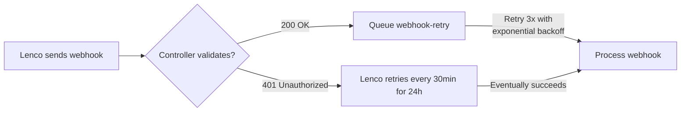

This means a single webhook could be processed up to 48 times (24h / 0.5h) + 3 BullMQ retries. **Recommendation:** Return `200 OK` with `{success: false}` instead of 401 for signature failures, and let only the BullMQ queue handle retries.

### B.5 Error Code Gaps

The Lenco docs (`02_getting_started/01_getting_started.md:97-110`) list these error codes:

| Code | Meaning | In codebase? |
|---|---|---|
| 01 | Validation error | ✅ `error-mapper.ts` |
| 02 | Insufficient funds | ✅ |
| 03 | Transfer limit exceeded | ✅ |
| 04 | Invalid/duplicate reference | ✅ |
| 05 | Invalid recipient account | ✅ |
| 06 | Restriction on debit account | ✅ |
| 07 | Invalid bulk transfer reference | ✅ |
| 08 | Invalid number in bulk transfer | ✅ |
| 21 | POS terminal not found | ❌ **Not in error-mapper.ts** |
| 22 | POS terminal already assigned | ❌ **Not in error-mapper.ts** |
| 23 | POS terminal not assigned | ❌ **Not in error-mapper.ts** |
| 24 | POS transaction not found | ❌ **Not in error-mapper.ts** |

Codes 21-24 are POS-only and unlikely to appear for this integration. Low priority.

### B.6 Card Collection Encryption Requirement

Per `09_collections/05_collectionscard.md:15`:
> The request payload would be encrypted. Please follow the guide [here](https://lenco-api.readme.io/v2.0/reference/encryption).

The `POST /collections/card` endpoint requires JWE (JSON Web Encryption) with RSA-OAEP-256 + AES-GCM. The codebase does **not** implement direct card collection API calls — all card payments go through the Lenco widget, which handles encryption internally. **No action needed.** ✅

### B.7 `reference` Can Be Null in Webhooks

Per `12_webhooks/01_webhooks.md:197`:
```json
"reference": string | null,
```

The codebase's webhook handlers check `if (!reference) return;` which correctly handles null references. However, the lookup logic at `payments.service.ts:501-521` falls back to `lencoReference` when `reference` is null/empty. ✅

### B.8 Test Accounts Coverage

The Lenco sandbox test accounts (`03_accept_payments/02_test_cards_and_accounts.md`) are already referenced in `payments/README.md` and the E2E test file uses proper sandbox numbers. The codebase correctly uses `0971111111` for successful Airtel (ZM) tests. ✅

---

## Appendix C: Quick Reference — Env Var Matrix

| Variable | Production | Sandbox | Client | Server | Required |
|---|---|---|---|---|---|
| `LENCO_SECRET_KEY` | `sk_live_xxx` | — | ❌ | `lenco-api.service.ts:54`, `webhook.service.ts:75` | ✅ Production |
| `LENCO_PUBLIC_KEY` | `pk_live_xxx` | — | ❌ | `lenco-api.service.ts:54` (stored) | ✅ Production |
| `LENCO_BASE_URL` | `https://api.lenco.co/access/v2` | — | ❌ | `lenco-api.service.ts:41` | Default |
| `LENCO_SANDBOX_SECRET_KEY` | — | `sk_sandbox_xxx` | ❌ | `lenco-api.service.ts:49`, `webhook.service.ts:72` | ✅ Sandbox |
| `LENCO_SANDBOX_PUBLIC_KEY` | — | `pk_sandbox_xxx` | ❌ | `lenco-api.service.ts:51` (stored) | ✅ Sandbox |
| `LENCO_SANDBOX_URL` | — | `https://api-sandbox.lenco.co/access/v2` | ❌ | `lenco-api.service.ts:36` | Default |
| `PUBLIC_LENCO_PUBLIC_KEY` | `pk_live_xxx` | `pk_sandbox_xxx` | ✅ `PaymentButton.svelte:118` | ❌ | ✅ Always |
| `WEBHOOK_URL` | `https://your-domain.com/api/payments/webhook` | `https://ngrok-url/api/payments/webhook` | ❌ | `webhook.service.ts:113` | ✅ Always |
| `LENCO_ENV` | `live` (forces production in any NODE_ENV) | unset or absent | ❌ | `lenco-api.service.ts:32`, `webhook.service.ts:13` | No |
| `NODE_ENV` | `production` | `development` | ❌ | `lenco-api.service.ts:31`, `webhook.service.ts:12` | ✅ Always |
| `SIGNATURE_KEY` | **NOT USED** — present in README only | — | ❌ | _Nowhere_ | ❌ Legacy doc |
| `PAYMENT_PENDING_TIMEOUT_MINUTES` | `30` (default) | `30` | ❌ | `payment-timeout.service.ts:40` | No |
| `PAYMENT_CONFIRMATION_TIMEOUT_MINUTES` | `120` (default) | `120` | ❌ | `payment-timeout.service.ts:119` | No |

---

## Appendix D: Dead Code Inventory

### D.1 Fully Dead — Safe to Remove

| Dead Item | Type | File:Line | Last active call | Recommendation |
|---|---|---|---|---|
| `getPublicKey()` | Method | `lenco-api.service.ts:273` | **Zero callers** — frontend uses `PUBLIC_LENCO_PUBLIC_KEY` from env | Remove method |
| `getWidgetUrl()` | Method | `lenco-api.service.ts:287` | **Zero callers** — both client loaders hardcode `pay.lenco.co/js/v1/inline.js` | Remove method |
| `isSandboxMode()` | Method | `lenco-api.service.ts:280` | **Zero callers** — not even mocked in tests | Remove method |
| `CurrencyService` | Class | `currency.service.ts` | **Zero consumers** — never imported or injected in production code. The same inline logic exists in `payments.service.ts:107-131` | Remove entire file |
| `paymentPlans` table | Table | `payments.schema.ts:115-134` | **Zero reads/writes** — full schema with 4 Zod validation schemas and 4 TypeScript types, no service touches it | Remove table + schemas |
| `createPaymentPlanSchema` | Zod schema | `payments.schema.ts:264` | References unused `paymentPlans` table | Remove |
| `updatePaymentPlanSchema` | Zod schema | `payments.schema.ts:282` | References unused `paymentPlans` table | Remove |
| `CreatePaymentPlanInput` | TS type | `payments.schema.ts:294` | Inferred from unused schema | Remove |
| `UpdatePaymentPlanInput` | TS type | `payments.schema.ts:295` | Inferred from unused schema | Remove |

### D.2 Dead Env Vars

| Variable | Status | Details |
|---|---|---|
| `SIGNATURE_KEY` | **Fully dead** — mentioned in README as `LENCO_SIGNATURE_KEY` but never read by any code. Actual HMAC signing uses `LENCO_SECRET_KEY` / `LENCO_SANDBOX_SECRET_KEY` directly | Remove from env docs |
| `LENCO_PUBLIC_KEY` | **Read but dead** — stored in `LencoApiService.publicKey` at init, never exposed via any method call. Frontend uses `PUBLIC_LENCO_PUBLIC_KEY` directly | Remove from server (client var already covers it) |
| `LENCO_SANDBOX_PUBLIC_KEY` | **Read but dead** — same as above for sandbox | Remove from server |

### D.3 Dead in Tests Only

| Item | File:Line | Why Dead |
|---|---|---|
| `getPublicKey` mock | `payments.service.spec.ts:46`, `payments.e2e-spec.ts:40` | Mocks a method no consumer calls |
| `getWidgetUrl` mock | `payments.service.spec.ts:47`, `payments.e2e-spec.ts:41` | Mocks a method no consumer calls |
| `CurrencyService` mock | `payments.service.spec.ts:76,155` | Mocks a service no consumer injects |

---

## Appendix E: Over-Engineering Analysis

The Lenco docs recommend **two** confirmation mechanisms: webhooks + a re-query service every 30 minutes. This codebase implements **five**:

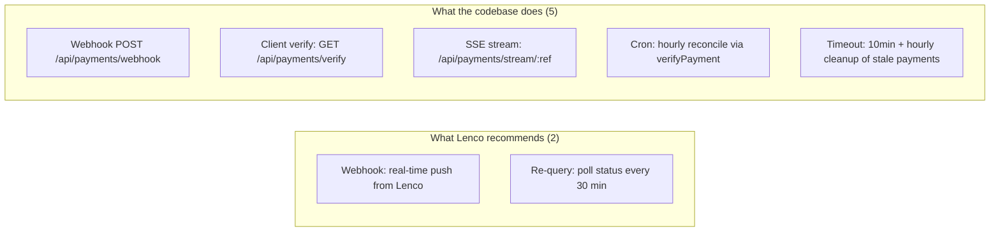

### E.1 SSE Gateway — UX Polish that Adds RxJS Complexity

`payment-status.gateway.ts` (48 lines) + `startSSE()` in `PaymentButton.svelte` (~50 lines) + RxJS `Subject` per reference stored in a `Map<string, Subject>`.

| Concern | Risk |
|---|---|
| Memory leak | If client disconnects without a terminal event, `Subject` stays in the `Map` indefinitely |
| Auth overhead | SSE requires JWT token — every event carries auth parsing cost |
| Duplication | Client already has `verifyOnce()` with 3 retries + hourly cron as safety net |
| Value-add | The "Enrolled ✓" toast appears ~2 seconds faster than polling |

**Recommendation:** Remove the SSE gateway and the `streamPaymentStatus` SSE client. Rely on `verifyPayment` polling with exponential backoff (max 10 attempts, starting at 1s, doubling to ~8 min) + hourly cron. The user waits 2 more seconds; the codebase drops 100 lines and a memory-sensitive RxJS component.

### E.2 PaymentTimeoutService Duplicates the Reconciliation Cron

`payment-timeout.service.ts` (184 lines) runs two jobs:
1. Every **10 minutes**: marks `pending` payments older than `PAYMENT_PENDING_TIMEOUT_MINUTES` (default 30) → `failed`
2. Every **hour**: marks `confirmation` payments older than `PAYMENT_CONFIRMATION_TIMEOUT_MINUTES` (default 120) → `failed`

Both use **Redis distributed locks** (`tryLock()`) to prevent double-processing in multi-instance deployments.

**The fundamental flaw:** The timeout service marks payments as `failed` **without checking with Lenco**. A mobile money payment can be legitimately pending for 30+ minutes while the user authorizes the transaction via USSD. The hourly `PaymentsCron` already handles this correctly — it calls `verifyPayment(reference)` which queries Lenco and gets the real status.

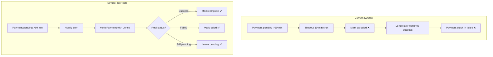

**Recommendation:** Remove `PaymentTimeoutService` and its dependency on Redis distributed locks. The hourly `PaymentsCron` already handles all stale payment scenarios correctly.

### E.3 Duplicate Webhook Handlers

These three methods in `webhook.service.ts` do the same thing:

| Method | Status set | Side effects |
|---|---|---|
| `handleFailedCollection()` | `failed` | Store reason + emit SSE |
| `handleTimeoutCollection()` | `failed` | Store reason + emit SSE |
| `handleInsufficientFunds()` | `failed` | Store reason + emit SSE |

**Recommendation:** Replace with one parameterized method:
```typescript
private handleFailedPayment(
  payment: Payment,
  data: LencoPaymentData,
  reason: string,
): Promise<void> {
  await this.paymentSvc.updatePaymentStatus(payment.id, 'failed');
  await this.paymentSvc.storeFailureReason(payment.id, reason);
  await this.emitPaymentEvent(payment.reference, { status: 'failed', reason });
}
```
This eliminates 30 lines of copy-paste and makes the handler easier to test.

### E.4 Audit Log Duplicates Reconstructable History

`paymentAuditLogs` is written to at **11** points in `payments.service.ts`:

| Event | File:Line |
|---|---|
| `INITIATED` | 167 |
| `FULFILLMENT_STARTED` | 786 |
| `FULFILLMENT_SUCCESS` | 870 |
| `FULFILLMENT_FAILED` | 878 |
| `ABANDONED` | 972 |
| `MANUAL_FULFILLMENT_RETRY` | 1116 |
| `REFUND_INITIATED` | 1208 |
| `REFUND_SUCCESS` | 1277 |
| `RECONCILIATION_STARTED` | 1337 |
| `RECONCILIATION_SUCCESS` | 1341 |
| `RECONCILIATION_FAILED` | 1355 |

**Why this is over-engineered:**
- `payments` table has `createdAt` + `updatedAt` timestamps — every state transition is tracked
- `webhooks` table stores every incoming webhook payload with `status` field — all external state changes are captured
- Any audit trail can be reconstructed by: `SELECT * FROM webhooks WHERE reference = $1 ORDER BY created_at` + `SELECT created_at, updated_at FROM payments WHERE reference = $1`
- The audit log requires an 11th `INSERT` per payment lifecycle, adding DB write load for no unique data

**Recommendation:** Remove `paymentAuditLogs` table and all `auditLog()` calls. If an audit trail is needed for compliance, generate it from `payments + webhooks` on demand.

### E.5 Queue Naming Drift

| Queue | Job name added | File:Line |
|---|---|---|
| `payment-fulfillment` | `'fulfill-payment'` | `payments.service.ts:368,402,629,1110` |
| `webhook-retry` | `'retry-webhook'` | `payments.service.ts:476` |

The naming convention is inconsistent: `fulfill-payment` is `verb-noun`, `retry-webhook` is `verb-noun` but reverse semantic. Trivial but indicates naming drift.

**Recommendation:** Rename `'retry-webhook'` → `'webhook-retry'` to match the queue name convention, or rename the queue to match the job name. Pick one pattern and apply consistently.

---

## Appendix F: Webhook vs Timeout Strategy — Correction

The Lenco documentation is clear on the recommended architecture:

> *"You may not be able to rely completely on webhooks to get notified. An example is if your server is experiencing a downtime... In such cases we advise that developers set up a re-query service that goes to poll for the transaction status at regular intervals e.g. every 30 minutes."*
> — `03_accept_payments/05_requery_service.md`

This means the canonical approach is:

### F.1 Correct Three-Layer Architecture

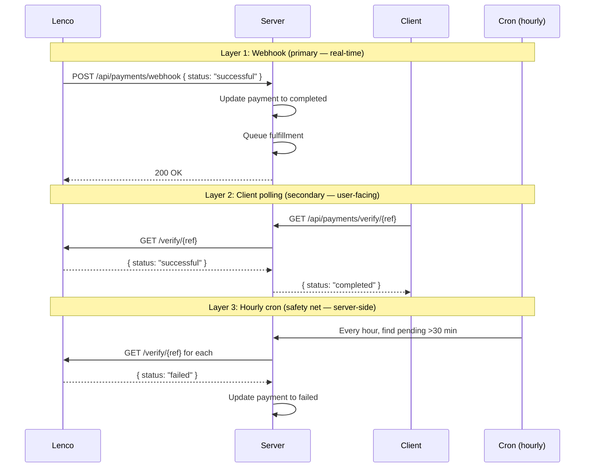

### F.2 What Not to Do

| ❌ Current approach | ✅ Correct approach | Why |
|---|---|---|
| `PaymentTimeoutService` blindly marks pending → failed **without checking Lenco** | Let the hourly cron call `verifyPayment()` which checks the real status | Marking a pending payment as failed when it's still processing at Lenco is a data corruption bug |
| SSE gateway streams per-payment events to client | Use client-side polling with `setTimeout(fn, 3000)` retry loop | SSE adds RxJS memory subjects, JWT auth overhead, and only saves ~2 seconds |
| `webhook-retry` BullMQ queue re-processes failed webhooks | Return 200 `{success: false}` and let Lenco retry on its own 30-min schedule | Two independent retry systems (Lenco 30min × 24h + BullMQ 1/2/4 min) create race conditions |

### F.3 Why the 10-Minute Timeout Is Wrong (Detailed)

The `PaymentTimeoutService` marks `pending` → `failed` when `now - createdAt > PAYMENT_PENDING_TIMEOUT_MINUTES`:

```typescript
// payment-timeout.service.ts:60-70 (paraphrased)
const cutoff = new Date(Date.now() - timeout * 60_000);
await db.update(payments)
  .set({ status: 'failed' })
  .where(and(
    eq(payments.status, 'pending'),
    lt(payments.createdAt, cutoff),
  ));
```

**Scenario that breaks:**

1. User initiates a mobile money payment (e.g., Airtel Money)
2. Lenco returns `status: pending` with a reference
3. User is busy — hasn't dialed the USSD PIN yet
4. After 30 minutes, the timeout service marks this as `failed`
5. User dials the USSD PIN 5 minutes later (at +35 min)
6. Lenco sends a `collection.success` webhook
7. Webhook handler tries to update a `failed` → `completed` transition — this may be rejected by the DB (enum constraint) or silently ignored if the handler only matches `pending` payments
8. Payment is stuck in `failed` with a successful Lenco reference — money collected but order not fulfilled

**The hourly cron does NOT have this problem** because it calls `verifyPayment(reference)` which returns the real status from Lenco. If Lenco says `successful`, it marks the payment `completed`. If Lenco says `failed`, it marks it `failed`. It never assumes.

### F.4 Recommended Removal Plan

| File | Lines | Action | Risk if removed |
|---|---|---|---|
| `payment-status.gateway.ts` | 48 | Delete entire file | Client toast appears 2s slower |
| `payment-timeout.service.ts` | 184 | Delete entire file | `PaymentsCron` handles the same use case correctly |
| `currency.service.ts` | 155 | Delete entire file | No consumer exists |
| `lenco-api.service.ts:273-295` | 22 | Delete `getPublicKey()`, `getWidgetUrl()`, `isSandboxMode()` | No caller exists |
| `payments.schema.ts:115-134`, `:193-194`, `:205-206`, `:232-295` | 85 | Delete `paymentPlans` table + all associated schemas/types | Feature was planned but never implemented |
| `webhook.service.ts` — 3x duplicate handlers | 30 | Merge into one `handleFailedPayment()` | Slight refactor |
| `processors/webhook-retry.processor.ts` | 90 | Delete or disable | Lenco retries on its own; BullMQ concurrent retries cause race conditions |
| `payments.service.ts:476` | 1 | Remove `webhookRetryQueue.add()` call | Webhook handler returns 200 `{success: false}` instead of 401 |

**Total savings:** ~615 lines of code, 4 files deleted, 1 Redis dependency removed, 1 BullMQ queue removed, 1 table removed from schema.

---

<!-- EOF -->
